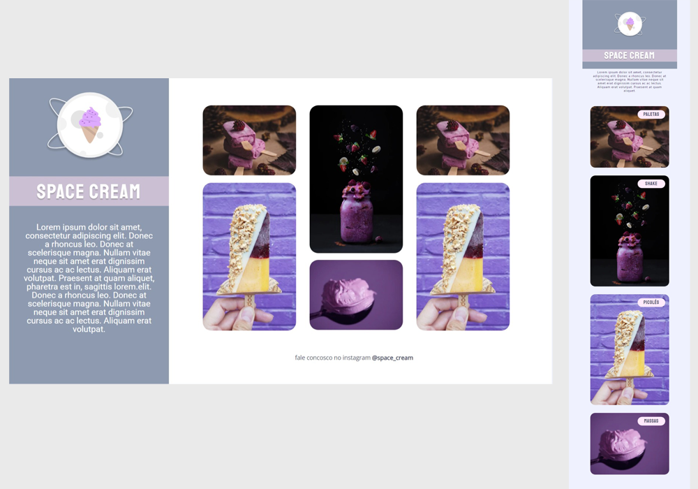

<h1 align="center">Challenge - Space Cream</h1>

Explorer is a complete program that brings together everything you need to start in the world of web programming, helping you to develop your technical and behavioral skills, so that you reach your first job in the programming market. 

  <a href="#-technologies">Technologies</a>&nbsp;&nbsp;&nbsp;|&nbsp;&nbsp;&nbsp;
  <a href="#-project">Project</a>&nbsp;&nbsp;&nbsp;|&nbsp;&nbsp;&nbsp;
  <a href="#-layout">Layout</a>&nbsp;&nbsp;&nbsp;|&nbsp;&nbsp;&nbsp;
  <a href="#memo-icense">License</a>

  

 

  

 

## 🚀 Technologies

 
This project was developed with the following technologies:

- HTML and CSS
- Figma

 

## 💻 Project

 
Develop an application called Ice Cream, a website that features various types of ice cream and created to be responsive.
 
 
At Land8, we were challenged to recreate the entire Ice Cream project. Using English class and variable names. We were also proposed to create the README 100% in English.
 
 

- [Visit the project](https://wilkasantos.github.io/explorer-nvl8-recreateIceCreamProjectInEnglish/)

 

## 🔖 Layout

The project layout can be found in Figma and you can access it through [LINK](https://www.figma.com/file/Ljd5XKG9oalJDbFNjgDRKZ/Stage-03---Grid-com-animações-(Copy)?node-id=0-1&t=rQplvtnl0eeP2JDj-0).

 

## 🔒 License

This project is licensed under the MIT.
